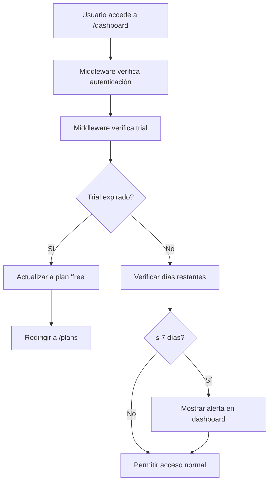

# 🎯 Sistema de Verificación de Trial - Agendalook.cl

## 📋 **Resumen**

Sistema completo para verificar la expiración de períodos de prueba y evitar que usuarios con trial vencido accedan al dashboard.

## 🏗️ **Arquitectura del Sistema**

### **1. Middleware de Verificación** (`src/middleware/checkTrial.ts`)
- **Función**: `checkTrialExpiration(userId)`
- **Propósito**: Verifica si el trial del usuario ha expirado
- **Retorna**: Estado del trial, días restantes, y si debe redirigir

### **2. Middleware Principal** (`src/middleware.ts`)
- **Integración**: Verifica trial en rutas protegidas (`/dashboard`)
- **Acción**: Redirige a `/plans` si el trial ha expirado
- **Logging**: Registra eventos de expiración

### **3. Hook Frontend** (`src/hooks/useTrialStatus.ts`)
- **Propósito**: Estado del trial en componentes React
- **Funciones**: `isTrial`, `isExpired`, `daysRemaining`
- **Actualización**: Automática cuando cambia el usuario

### **4. Componente de Alerta** (`src/components/ui/TrialAlert.tsx`)
- **Ubicación**: Dashboard principal
- **Alertas**: 7, 3, y 0 días restantes
- **Acciones**: Botones para ver planes y precios

## 🔄 **Flujo de Verificación**



## 📊 **Base de Datos**

### **Campos Agregados a `professionals`:**
```sql
trial_start_date TIMESTAMP WITH TIME ZONE
trial_end_date TIMESTAMP WITH TIME ZONE  
subscription_status TEXT DEFAULT 'none'
```

### **Triggers Automáticos:**
1. **Nuevos usuarios**: Asignan trial de 30 días automáticamente
2. **Expiración**: Cambian a plan 'free' cuando expira

## 🎨 **Componentes UI**

### **TrialAlert** - Alertas Visuales
- **7 días**: Alerta azul informativa
- **3 días**: Alerta naranja de advertencia  
- **0 días**: Alerta roja crítica
- **Acciones**: Botones para ver planes y precios

### **Página de Planes** - Mensaje de Expiración
- **Mensaje**: "Tu período de prueba ha expirado"
- **Acción**: Forzar selección de plan
- **URL**: `/plans?trial-expired=true&message=...`

## 🔧 **Configuración**

### **1. Ejecutar Script SQL:**
```sql
-- En Supabase SQL Editor
-- Ejecutar: scripts/setup-trial-system.sql
```

### **2. Variables de Entorno:**
```env
NEXT_PUBLIC_SUPABASE_URL=tu_url_supabase
SUPABASE_SERVICE_ROLE_KEY=tu_service_role_key
```

### **3. Rutas Protegidas:**
```typescript
// En src/middleware.ts
const protectedRoutes = ['/dashboard'];
```

## 📱 **Experiencia de Usuario**

### **Usuario con Trial Activo:**
1. ✅ Acceso normal al dashboard
2. 🔔 Alertas cuando quedan ≤ 7 días
3. 🎯 Botones para ver planes

### **Usuario con Trial Expirado:**
1. 🚫 Bloqueo automático del dashboard
2. 🔄 Redirección a página de planes
3. ⚠️ Mensaje de expiración
4. 💳 Forzar selección de plan

## 🧪 **Testing**

### **Crear Usuario de Prueba:**
```sql
-- Usuario con trial expirado
UPDATE professionals 
SET trial_end_date = NOW() - INTERVAL '1 day'
WHERE email = 'test@example.com';
```

### **Verificar Funcionamiento:**
1. **Login** con usuario de prueba
2. **Acceso** a `/dashboard`
3. **Verificar** redirección a `/plans`
4. **Confirmar** mensaje de expiración

## 🚀 **Próximos Pasos**

1. **Integración con MercadoPago**: Renovación automática
2. **Notificaciones por email**: Recordatorios de expiración
3. **Analytics**: Tracking de conversiones trial → paid
4. **A/B Testing**: Diferentes períodos de trial

## 🔍 **Monitoreo**

### **Logs Importantes:**
- `🔍 Middleware: Verificando expiración de trial`
- `⚠️ Middleware: Trial expirado, redirigiendo a planes`
- `✅ Profesional actualizado a plan free tras expiración`

### **Métricas Clave:**
- Usuarios con trial activo
- Conversiones trial → paid
- Tiempo promedio hasta expiración
- Tasa de retención post-expiración
